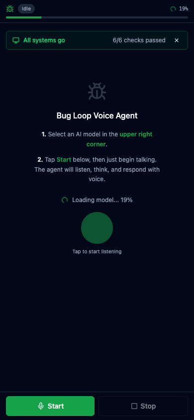
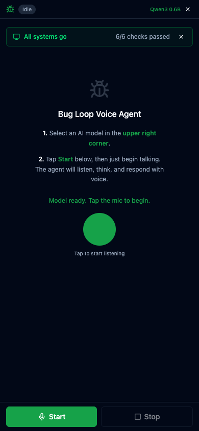

# Browser Voice Agent

> A fully browser-native voice agent powered by local LLMs, text-to-speech, and speech recognition. No server required — everything runs on your device.



---

## What is this?

A real-time voice conversation agent that runs entirely in your browser:

1. **You speak** — Web Speech API transcribes your voice
2. **Agent thinks** — A local LLM (via WebGPU) classifies your intent and generates a response
3. **Agent speaks back** — Text-to-speech reads the response aloud
4. **Loop repeats** — The agent adapts its behavior based on your reactions

No API keys. No cloud servers. No data leaves your device.

---

## Features

- **Local LLM inference** via WebGPU — choose from 15+ models (0.4GB to 5.5GB)
- **Text-to-Speech** — VITS neural voices on desktop, native SpeechSynthesis on mobile
- **Speech-to-Text** — Web Speech API with continuous listening and silence detection
- **FSM architecture** — 8-stage state machine: Listen → Detect → Classify → Respond → Speak → Observe → Adapt → Loop
- **Streaming TTS** — sentences are spoken as the LLM generates them, not after
- **Dual voice mode** — internal monologue (soft female) + response (British voice) on desktop
- **Adaptive bias system** — the agent adjusts verbosity, confidence thresholds, and response speed over time
- **Full dashboard** — stage pipeline, decision trace, prompt inspection, bias sliders, A/B model comparison

---

## Mobile / iPhone



The app works on **iPhone Chrome** (iOS 18+) with automatic optimizations:

| Feature | Desktop (Chrome) | iPhone (Chrome) |
|---------|------------------|-----------------|
| LLM | WebGPU | WebGPU |
| TTS | VITS neural voices | Native SpeechSynthesis (auto-fallback) |
| STT | Web Speech API | Web Speech API |
| Concurrency | 2 parallel TTS chunks | 1 (reduced for memory) |
| Think tags | Spoken as monologue | Skipped (response only) |

**Safari is not supported** — it lacks the required WebGPU and Web Speech API support. The app shows a clear message if opened in Safari.

### Mobile optimizations

- ONNX/VITS skipped entirely on iOS — native `speechSynthesis` used from the start
- Audio unlock on first tap (iOS requires user gesture for speech output)
- AudioContext suspended during TTS to prevent audio session conflicts
- Backpressure on TTS queue (max 3 pending chunks) to prevent memory exhaustion

---

## Quick Start

```bash
git clone https://github.com/davidbmar/browser-voice-agent-with-TTS-STT-and-OpenSourceLLMs-demo.git
cd browser-voice-agent-with-TTS-STT-and-OpenSourceLLMs-demo
npm install
npm run dev
```

Open **http://localhost:5173** in Chrome. The app auto-loads the Qwen3 0.6B model on startup.

### Requirements

- **Chrome 113+** or **Edge 113+** (WebGPU required)
- A GPU with at least 1GB VRAM for the smallest models
- Microphone access for speech recognition

---

## Deploy to AWS

The included `deploy.sh` script handles S3 + CloudFront deployment with proper COOP/COEP headers (required for SharedArrayBuffer):

```bash
# First time: set up S3 bucket, CloudFront distribution, and response headers
./deploy.sh --setup

# Subsequent deploys: build, sync to S3, invalidate cache
./deploy.sh
```

---

## Architecture

```
┌─────────────────────────────────────────────────────┐
│                   FSM Loop                          │
│                                                     │
│  IDLE → LISTENING → SIGNAL_DETECT → CLASSIFY        │
│    ↑                                    ↓           │
│  UPDATE_BIAS ← FEEDBACK_OBSERVE ← SPEAK ← RESPOND  │
│                                                     │
└─────────────────────────────────────────────────────┘
```

| Stage | What happens |
|-------|-------------|
| **LISTENING** | Mic active, Web Speech API transcribes in real-time |
| **SIGNAL_DETECT** | VAD monitors audio levels, detects silence for turn-end |
| **CLASSIFY** | Intent classification (rule-based or LLM) |
| **MICRO_RESPONSE** | LLM generates response with streaming token output |
| **SPEAK** | TTS speaks the response (sentences streamed as generated) |
| **FEEDBACK_OBSERVE** | Watches for user reaction (interruption, silence, acknowledgement) |
| **UPDATE_BIAS** | Adjusts system parameters based on observed reaction |

---

## Tech Stack

| Layer | Technology |
|-------|-----------|
| Framework | React 19 + TypeScript |
| Build | Vite 7 |
| Styling | Tailwind CSS v4 |
| UI Components | shadcn/ui |
| LLM Runtime | [WebLLM](https://github.com/mlc-ai/web-llm) (WebGPU) |
| TTS (Desktop) | [vits-web](https://github.com/diffusionstudio/vits-web) (ONNX/VITS) |
| TTS (Mobile) | Native `SpeechSynthesis` API |
| STT | Web Speech API (`SpeechRecognition`) |
| Hosting | S3 + CloudFront |

---

## Project Structure

```
src/
├── lib/
│   ├── loop-controller.ts   # Core FSM — state machine + event dispatch
│   ├── loop-types.ts        # State, events, model catalog
│   ├── audio-listener.ts    # Mic + speech recognition + audio levels
│   ├── tts-speaker.ts       # TTS engine (VITS + native fallback)
│   ├── llm-engine.ts        # WebLLM wrapper for local inference
│   ├── prompt-templates.ts  # Classification + response prompts
│   ├── decision-trace.ts    # Event log for debugging
│   └── bias-store.ts        # Adaptive parameter system
├── hooks/
│   ├── use-loop.ts          # React hook wrapping LoopController
│   └── use-mobile.ts        # Viewport-based mobile detection
├── components/
│   ├── layout/              # Desktop + mobile layouts
│   ├── loop/                # Stage diagram, controls
│   ├── model/               # Model selector, toggles, A/B panel
│   ├── state/               # Internal state display, bias sliders
│   ├── prompts/             # Prompt inspection panel
│   ├── trace/               # Decision trace viewer
│   ├── history/             # Conversation history timeline
│   ├── capabilities/        # Browser capability detection
│   └── ui/                  # shadcn/ui primitives
└── main.tsx
```

---

## License

MIT
